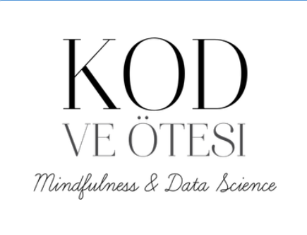

<!--
**zycncl/zycncl** is a ✨ _special_ ✨ repository because its `README.md` (this file) appears on your GitHub profile.

Here are some ideas to get you started:

- 🔭 I’m currently working on ...
- 🌱 I’m currently learning ...
- 👯 I’m looking to collaborate on ...
- 🤔 I’m looking for help with ...
- 💬 Ask me about ...
- 📫 How to reach me: ...
- 😄 Pronouns: ...
- ⚡ Fun fact: ...
-->
<h1 align="center">Hi 👋, I'm Zeynep Can CELIKOGLU</h1>
<h3 align="center">I have a Bachelor's degree in Statistics with a specialization in Data Science
and focus on business development through Business Intelligence and data-driven analytics projects.</h3>

  

- 🌱 I’m currently using  **Scikit-learn & Pandas & Numpy**

- 📝 I regularly write articles on ✍️ <a href="https://zeynepcancelikoglu.medium.com/" target="_blank"> <b>Kod ve Ötesi 

<h3 align="left">Connect with me:</h3>

  

<h3 align="left">Languages and Tools:</h3>

  <a href="https://www.microsoft.com/en-us/sql-server" 

  <a href="https://www.python.org" 

  <a href="https://app.powerbi.com" 
